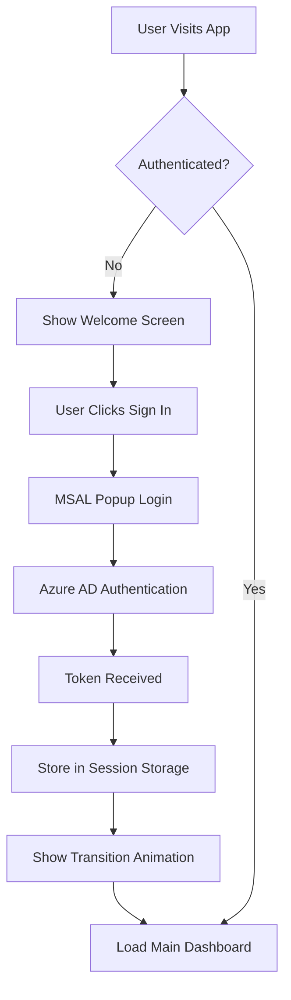
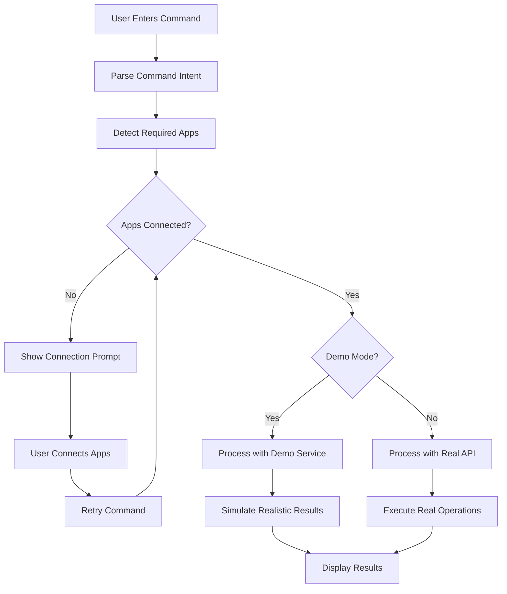
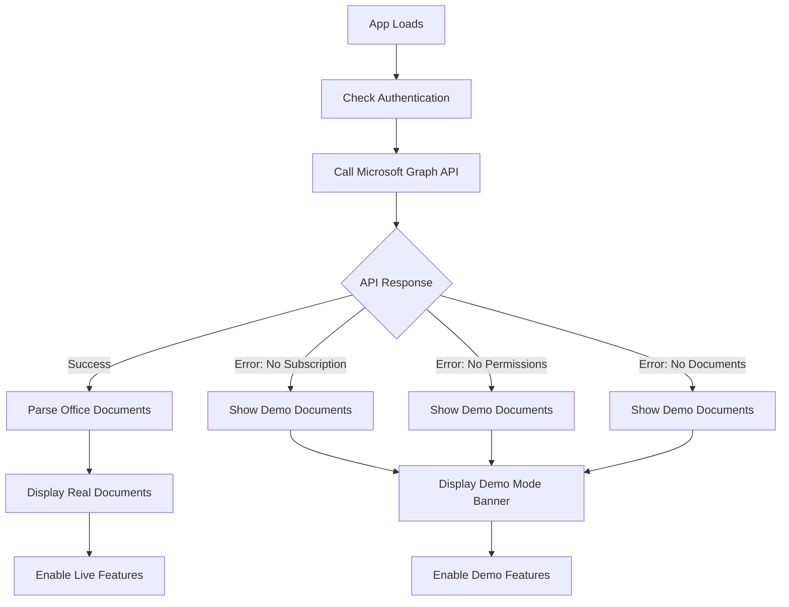
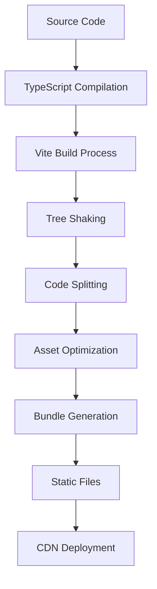

# Samara Architecture Documentation

## 🏗️ System Architecture Overview

Samara is built as a modern single-page application (SPA) that integrates deeply with the Microsoft 365 ecosystem. The architecture follows React best practices with a focus on modularity, type safety, and performance.

## 🔧 Core Architecture Principles

### 1. **Component-Driven Development**

- **Atomic Design**: Components are built from small, reusable pieces
- **Single Responsibility**: Each component has a clear, focused purpose
- **Composition over Inheritance**: Complex UIs built by composing simpler components

### 2. **Type-Safe Development**

- **Strict TypeScript**: Full type coverage across the entire codebase
- **Interface-First Design**: Clear contracts between components and services
- **Runtime Type Validation**: Critical data validated at runtime boundaries

### 3. **State Management Strategy**

- **Local State First**: React hooks for component-specific state
- **Prop Drilling Minimization**: Strategic state lifting and context usage
- **Immutable Updates**: Predictable state changes using functional patterns

## 📦 Module Architecture

```
┌─────────────────────────────────────────────────────────────┐
│                     Presentation Layer                      │
├─────────────────────────────────────────────────────────────┤
│  React Components (UI/UX)                                  │
│  ├── AuthenticatedApp (Main Container)                     │
│  ├── AICommandInterface (Command Processing)               │
│  ├── AppDashboard (Widget Management)                      │
│  ├── AppWidget (Individual App Views)                      │
│  └── EmbeddedDocumentEditor (Document Editing)             │
├─────────────────────────────────────────────────────────────┤
│                     Business Logic Layer                    │
├─────────────────────────────────────────────────────────────┤
│  Custom Hooks & Services                                   │
│  ├── useGraphData (Microsoft Graph Integration)            │
│  ├── DemoAICommandProcessor (Demo Mode Logic)              │
│  └── RealAICommandProcessor (Live API Integration)         │
├─────────────────────────────────────────────────────────────┤
│                     Integration Layer                       │
├─────────────────────────────────────────────────────────────┤
│  External APIs & Authentication                            │
│  ├── MSAL (Microsoft Authentication)                       │
│  ├── Microsoft Graph API (Document Access)                 │
│  └── Fluent UI (Design System)                            │
└─────────────────────────────────────────────────────────────┘
```

## 🔄 Data Flow Architecture

### Authentication Flow



### AI Command Processing Flow



### Document Loading Flow



## 🧩 Component Architecture

### Core Component Hierarchy

```
AuthenticatedApp (Root Container)
├── WelcomeScreen (Authentication & Onboarding)
├── Header (Navigation & Status)
├── AICommandInterface (Command Input & Processing)
├── AppDashboard (App Management)
│   └── AppWidget[] (Individual App Views)
│       └── EmbeddedDocumentEditor (Document Editing)
├── AppIntegrationSidebar (Connection Management)
└── SettingsPanel (Configuration & History)
```

### Component Communication Patterns

#### 1. **Props Down, Events Up**

```typescript
// Parent passes data down
<AICommandInterface
  connectedApps={connectedApps}
  onCommandExecute={handleCommandExecute}
/>;

// Child communicates up via callbacks
const handleSubmit = () => {
  onCommandExecute?.(command, detectedApps);
};
```

#### 2. **State Lifting**

```typescript
// Shared state lifted to common ancestor
const [connectedApps, setConnectedApps] = useState<string[]>([]);

// Passed to multiple children that need it
<AppDashboard connectedApps={connectedApps} />
<AICommandInterface connectedApps={connectedApps} />
```

#### 3. **Custom Hooks for Logic Sharing**

```typescript
// Reusable logic in custom hooks
const { documents, loading, error } = useGraphData();

// Used across multiple components
const AppWidget = () => {
  const { documents } = useGraphData();
  // Component logic...
};
```

## 🔐 Security Architecture

### Authentication Security Model

```
┌─────────────────────────────────────────────────────────────┐
│                     Client Application                      │
│  ┌─────────────────────────────────────────────────────┐   │
│  │              MSAL.js Library                        │   │
│  │  ├── Token Storage (Session Storage)               │   │
│  │  ├── Token Refresh Logic                           │   │
│  │  └── Secure HTTP Interceptors                      │   │
│  └─────────────────────────────────────────────────────┘   │
└─────────────────────────────────────────────────────────────┘
                              │
                              │ OAuth 2.0 / OpenID Connect
                              ▼
┌─────────────────────────────────────────────────────────────┐
│                    Microsoft Identity Platform              │
│  ├── Azure Active Directory                                │
│  ├── Multi-Factor Authentication                           │
│  ├── Conditional Access Policies                           │
│  └── Token Validation & Issuance                           │
└─────────────────────────────────────────────────────────────┘
                              │
                              │ Validated Tokens
                              ▼
┌─────────────────────────────────────────────────────────────┐
│                    Microsoft Graph API                      │
│  ├── OneDrive/SharePoint Documents                         │
│  ├── User Profile Information                              │
│  ├── Calendar & Email Access                               │
│  └── Teams Integration                                     │
└─────────────────────────────────────────────────────────────┘
```

### Security Best Practices Implemented

1. **Token Security**

   - Tokens stored in session storage (cleared on browser close)
   - Automatic token refresh before expiration
   - Secure token transmission over HTTPS only

2. **API Security**

   - Minimal required permissions (principle of least privilege)
   - Scope-limited access tokens
   - Proper error handling for unauthorized requests

3. **Client-Side Security**
   - No sensitive data stored in localStorage
   - XSS protection through React's built-in sanitization
   - CSRF protection through SameSite cookie policies

## 📊 Performance Architecture

### Optimization Strategies

#### 1. **Bundle Optimization**

```typescript
// Tree shaking for Fluent UI components
import { Button, Text } from "@fluentui/react-components";
// Instead of importing entire library

// Code splitting for large components
const SettingsPanel = lazy(() => import("./SettingsPanel"));
```

#### 2. **React Performance Patterns**

```typescript
// Memoization for expensive computations
const expensiveValue = useMemo(() => {
  return processLargeDataSet(documents);
}, [documents]);

// Component memoization
const AppWidget = React.memo(({ app, isMinimized }) => {
  // Component logic...
});

// Callback memoization
const handleAppConnection = useCallback((appId: string) => {
  // Handler logic...
}, []);
```

#### 3. **Animation Performance**

```typescript
// Hardware-accelerated animations
<motion.div
  style={{ transform: 'translateZ(0)' }} // Force GPU layer
  animate={{ x: 100 }}
  transition={{ type: 'spring', damping: 25 }}
/>

// Efficient list animations
<AnimatePresence mode="wait">
  {items.map(item => (
    <motion.div key={item.id} layout>
      {/* Content */}
    </motion.div>
  ))}
</AnimatePresence>
```

### Performance Monitoring

#### Key Metrics Tracked

- **First Contentful Paint (FCP)**: < 1.5s
- **Largest Contentful Paint (LCP)**: < 2.5s
- **Cumulative Layout Shift (CLS)**: < 0.1
- **First Input Delay (FID)**: < 100ms

#### Performance Budgets

- **JavaScript Bundle**: < 250KB gzipped
- **CSS Bundle**: < 50KB gzipped
- **Image Assets**: < 500KB total
- **Font Loading**: < 100ms FOIT

## 🔄 State Management Architecture

### State Organization Strategy

```typescript
// Global App State (AuthenticatedApp)
interface AppState {
  // Authentication
  isAuthenticated: boolean;
  user: User | null;

  // UI State
  showWelcome: boolean;
  showTransition: boolean;
  highlightedApps: string[];

  // App Connections
  connectedApps: string[];

  // Command History
  recentCommands: AICommand[];
}

// Component-Specific State
interface AICommandState {
  command: string;
  isProcessing: boolean;
  validationError: ValidationError | null;
}

// Shared Hook State
interface GraphDataState {
  documents: OfficeDocument[];
  loading: boolean;
  error: string | null;
  accountType: "personal" | "business" | "unknown";
}
```

### State Update Patterns

#### 1. **Immutable Updates**

```typescript
// Array updates
setConnectedApps((prev) => [...prev, newAppId]);
setConnectedApps((prev) => prev.filter((id) => id !== removedId));

// Object updates
setUser((prev) => ({ ...prev, lastLogin: new Date() }));

// Complex state updates
setCommands((prev) =>
  prev.map((cmd) =>
    cmd.id === targetId ? { ...cmd, status: "completed" } : cmd
  )
);
```

#### 2. **Async State Management**

```typescript
const [loading, setLoading] = useState(false);
const [error, setError] = useState<string | null>(null);

const fetchData = async () => {
  setLoading(true);
  setError(null);

  try {
    const result = await apiCall();
    setData(result);
  } catch (err) {
    setError(err.message);
  } finally {
    setLoading(false);
  }
};
```

## 🧪 Testing Architecture

### Testing Strategy

#### 1. **Unit Testing**

```typescript
// Component testing with React Testing Library
test("renders AI command interface", () => {
  render(<AICommandInterface connectedApps={[]} />);
  expect(screen.getByPlaceholderText(/enter command/i)).toBeInTheDocument();
});

// Hook testing
test("useGraphData returns documents", async () => {
  const { result } = renderHook(() => useGraphData());
  await waitFor(() => {
    expect(result.current.documents).toHaveLength(6);
  });
});
```

#### 2. **Integration Testing**

```typescript
// End-to-end user flows
test("complete AI command workflow", async () => {
  render(<AuthenticatedApp />);

  // Simulate authentication
  fireEvent.click(screen.getByText("Sign In"));

  // Enter command
  fireEvent.change(screen.getByRole("textbox"), {
    target: { value: "Extract budget data from Excel" },
  });

  // Submit and verify results
  fireEvent.click(screen.getByText("Execute"));
  await waitFor(() => {
    expect(screen.getByText(/successfully extracted/i)).toBeInTheDocument();
  });
});
```

#### 3. **Visual Regression Testing**

```typescript
// Storybook stories for component isolation
export default {
  title: "Components/AppWidget",
  component: AppWidget,
};

export const ConnectedExcelApp = () => (
  <AppWidget app={mockExcelApp} isMinimized={false} isConnected={true} />
);
```

## 🚀 Deployment Architecture

### Build Process



### Environment Configuration

```typescript
// Development
const config = {
  apiUrl: "http://localhost:5173",
  msalConfig: {
    clientId: "dev-client-id",
    redirectUri: "http://localhost:5173",
  },
};

// Production
const config = {
  apiUrl: "https://samara.yourdomain.com",
  msalConfig: {
    clientId: "prod-client-id",
    redirectUri: "https://samara.yourdomain.com",
  },
};
```

### Deployment Targets

#### 1. **Static Hosting (Recommended)**

- **Netlify**: Automatic deployments from Git
- **Vercel**: Edge deployment with global CDN
- **Azure Static Web Apps**: Native Azure integration

#### 2. **Container Deployment**

```dockerfile
FROM node:18-alpine
WORKDIR /app
COPY package*.json ./
RUN npm ci --only=production
COPY dist ./dist
EXPOSE 3000
CMD ["npx", "serve", "-s", "dist", "-l", "3000"]
```

## 📈 Scalability Considerations

### Horizontal Scaling

- **Stateless Design**: No server-side state dependencies
- **CDN Distribution**: Global content delivery
- **API Rate Limiting**: Graceful handling of Microsoft Graph limits

### Vertical Scaling

- **Lazy Loading**: Components loaded on demand
- **Virtual Scrolling**: Efficient large list rendering
- **Memory Management**: Proper cleanup of event listeners and timers

### Future Extensibility

- **Plugin Architecture**: Easy addition of new Microsoft 365 apps
- **Theme System**: Customizable branding and styling
- **Internationalization**: Multi-language support ready
- **Offline Support**: Service worker integration planned

---

This architecture documentation provides a comprehensive overview of Samara's technical foundation, enabling developers to understand, maintain, and extend the system effectively.
